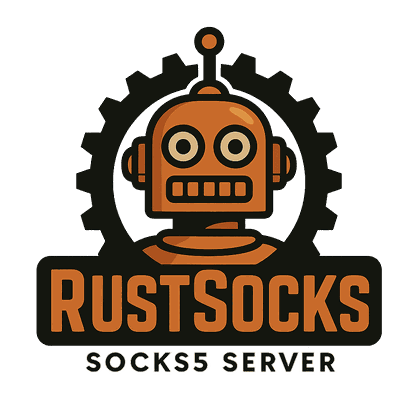

SOCKS PROXY PLATFORM

<h1>RustSocks</h1>

A high-performance SOCKS4/4a/5 proxy written in Rust, with fine-grained access control, dynamic policies, session tracking, QoS, Prometheus metrics and a web dashboard.

[Get started](usage/quick-start.md){ .md-button .md-button--primary }
[Configuration](config/rustsocks.md){ .md-button }
[GitHub](https://github.com/xulek/RustSocks){ .md-button }

  SOCKS4 / 4a / 5
  TLS &amp; mTLS
  ACL &amp; policies
  Prometheus
  Redis-shared limits
  Docker

  

## What you get

- :material-shield-lock:{ .lg .middle } **Secure by design**

    ---

    Username/password, PAM, GSS-API/Kerberos and mutual TLS. Failed logins are throttled per address, connections are limited per client, and the API fails closed.

    [:octicons-arrow-right-24: Authentication](guides/dashboard-authentication.md)

- :material-gate-and:{ .lg .middle } **Policies, not just rules**

    ---

    Schedules, source networks, authentication method, connection limits and transfer quotas, with a monitor mode and an Explain simulator.

    [:octicons-arrow-right-24: Policy engine](config/policy-engine.md)

- :material-chart-line:{ .lg .middle } **Observable**

    ---

    Prometheus metrics for decisions, admission denials and failed logins, plus an audit log of every state-changing API request.

    [:octicons-arrow-right-24: Metrics & audit log](guides/metrics-and-audit.md)

- :material-server-network:{ .lg .middle } **Scales out**

    ---

    Share limits and quotas between instances through Redis. Ship it with the hardened Docker image and Compose file.

    [:octicons-arrow-right-24: Docker deployment](usage/docker.md)

- :material-view-dashboard:{ .lg .middle } **Web dashboard**

    ---

    Live sessions, ACL and policy editing, users and groups, telemetry and SMTP alerts, with role-based access.

    [:octicons-arrow-right-24: Dashboard overview](ui/overview.md)

- :material-speedometer:{ .lg .middle } **Fast**

    ---

    Async Rust on Tokio. A policy decision takes microseconds even with hundreds of rules, and connection pooling reuses upstream sockets.

    [:octicons-arrow-right-24: Architecture](technical/architecture.md)

## Start here

1. **Install and run:** [Quick Start](usage/quick-start.md) builds the server and runs it with a sample configuration.
2. **Configure it:** the [`rustsocks.toml` reference](config/rustsocks.md) documents every option, and [`acl.toml`](config/acl.md) covers access rules.
3. **Open the dashboard:** [Dashboard overview](ui/overview.md), then [authentication](guides/dashboard-authentication.md) to set up logins and roles.
4. **See it in practice:** [Common scenarios](usage/examples.md).

## Documentation map

| Section | What you will find |
| --- | --- |
| [Getting Started](usage/quick-start.md) | Build, run, Docker and first-time setup |
| [UI & Dashboard](ui/overview.md) | Pages, workflows, authentication and SMTP alerts |
| [Configuration](config/rustsocks.md) | Full TOML reference, ACL rules and the policy engine |
| [Guides](guides/web-dashboard.md) | Base path deployment, LDAP and Active Directory, testing, metrics and audit |
| [Technical](technical/architecture.md) | Architecture, ACL engine, connection pool, protocol and TLS, PAM, sessions |
| [References](references/project-readme.md) | Project README, developer guide and load testing manual |
